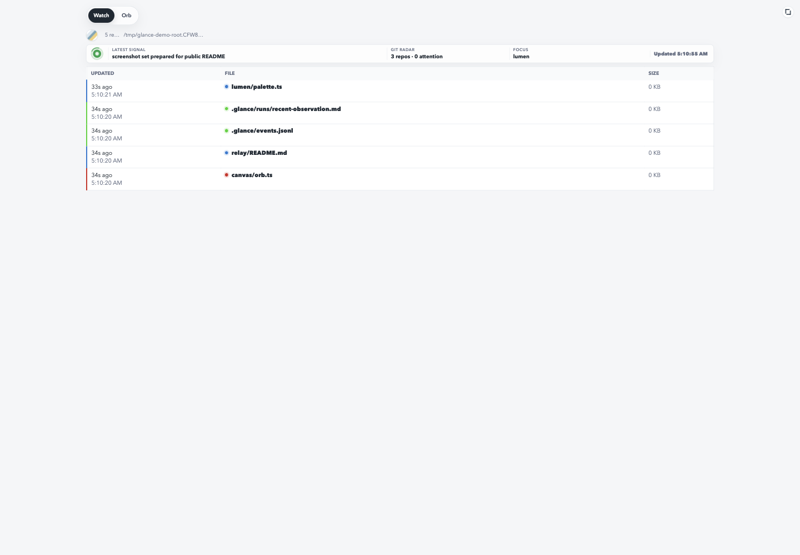
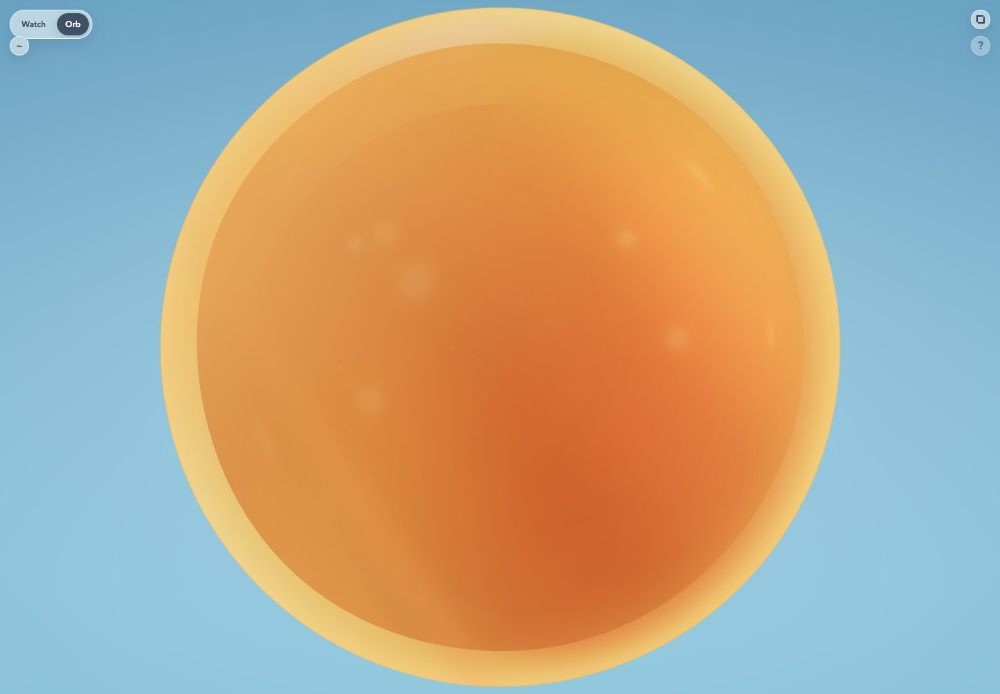

# Glance

**See your projects move. Then ask what happens when movement becomes control.**

Glance is a playful, local-first experiment in making work by people and agents visible, audible, and alive.

It began with a simple idea: instead of watching terminals, logs, and dashboards while agents work, what if you could sense that work in the room? Glance observes local project activity and expresses it through a live feed, color, sound, and a responsive 3D orb.

Today Glance is deliberately **read-only**. It can observe activity, but it cannot execute commands or control an agent. The longer-term exploration is more ambitious: can the same motions and ambient interactions eventually help steer an agent, a computer, a fleet, or a long-running loop?

> Observe activity → express it as motion → interact with that motion → steer the system producing it.

| Watch | Orb |
|---|---|
|  |  |

## What is Glance?

Glance runs locally and watches projects beneath a directory you choose. It presents that activity through two connected views:

- **Watch** is a practical view of recent files, projects, and repository state.
- **Orb** is an expressive environment driven by the same live signals.

```text
local project activity + optional event files
                    ↓
                Glance server
                  ↙     ↘
               Watch    Orb
```

This is not intended to be a conventional observability dashboard. It is an exploration of quieter and more embodied ways to coexist with active software systems—especially when several agents, projects, and loops may be moving at once.

## Why Orb?

Orb asks what project activity might *feel* like if it occupied space rather than a table of metrics.

Activity appears as colored pulses, movement, lingering traces, and generated sound. Different projects develop distinct visual and sonic identities, making it possible to notice where work is happening without continuously reading a feed.

Orb is also a small interaction laboratory:

- **Lava and Water surfaces** provide different motion models.
- **Room mode** presents Orb as a full ambient environment.
- **Buddy mode** creates a quieter, transparent companion view.
- **Ambient mode** reduces interface chrome and can keep the display awake.
- **Project tones** use generated timbre, pitch, and stereo position to distinguish activity.
- **Surface controls** tune motion, viscosity, gravity, slosh, waves, and other visual behavior.
- **Optional camera interactions** let smiles, hands, head movement, and stillness affect Orb locally in the page.
- **Optional microphone input** can contribute to local visual response.
- **Orb Lab** exposes experimental controls and gesture feedback for exploring how motion can become interaction.

Camera and microphone input are opt-in. Media is not uploaded or persisted by Glance.

The gestures currently affect the experience—not your tools. That boundary is intentional. Glance is read-only while the interaction language is explored safely.

## Where this could go

Orb’s current job is to turn machine activity into something people can perceive. A possible next step is to reverse that relationship: use motion, gestures, presence, and attention as input to the systems doing the work.

That could mean:

- encouraging an agent to continue, slow down, pause, or change focus;
- steering several agents without managing each terminal individually;
- signaling approval, uncertainty, urgency, or attention through simple motion;
- supervising long-running local workflows from an ambient surface;
- giving a computer or agent fleet a shared sense of human presence;
- creating feedback loops that are more spatial, playful, and intuitive than buttons and command lines.

None of those control capabilities exist yet. They describe the experiment Glance is moving toward.

---

# Tutorial: run Glance locally

Glance requires [Bun](https://bun.sh/).

```bash
git clone https://github.com/acoyfellow/glance.git
cd glance
bun install
GLANCE_ROOT=~/projects bun run server
```

Open either view:

```text
http://127.0.0.1:8788/       # Watch
http://127.0.0.1:8788/orb    # Orb
```

Glance observes the immediate projects beneath `GLANCE_ROOT`. If the variable is omitted, it observes the parent directory of its own checkout.

Check the local contract with:

```bash
bun test
```

## Try Orb

1. Open `http://127.0.0.1:8788/orb`.
2. Modify files in one or more observed projects.
3. Watch each project produce its own color, pulse, trace, and sound.
4. Open **Orb Lab** to switch between Lava and Water or Room and Buddy modes.
5. Enable ambient or gesture features if you want to explore the more experimental interactions.

A click or keypress may be required before browsers allow generated audio. Camera and microphone access are requested only when you opt into features that need them.

---

# How-to guides

## Persist your observed root

Copy the example configuration:

```bash
cp glance.config.example.json glance.config.json
```

Then edit it:

```json
{
  "root": "~/projects",
  "contextDir": ".glance"
}
```

`contextDir` is optional. Without it, Glance still shows file activity and git state; it simply has no additional event or receipt feed.

## Use Watch

Watch is the information-first surface. Use it to:

- follow a live recent-file feed;
- distinguish create, modify, delete, and other activity types;
- see per-project colors and activity sparklines;
- scan 42 days of your authored commits, stacked by repository and deduplicated by commit SHA across worktrees;
- review repository count, attention, and current focus in the git radar;
- switch between file and project views;
- enter fullscreen;
- hear project-specific activity chimes while work continues elsewhere.

## Use Orb as an ambient display

Open Orb, enable ambient mode, and place it on a secondary display or in an installed app window. When supported by the browser, ambient mode requests a screen wake lock so the surface can remain visible.

Use **Buddy mode** for a smaller transparent companion or **Room mode** for the full visual environment. Browser and operating-system support affect transparency, wake lock, titlebar integration, camera, and microphone behavior.

## Install the PWA

Open Glance in a browser that supports installable web apps and choose the browser’s install action. The app includes Watch and Orb shortcuts.

Window Controls Overlay support is browser- and platform-dependent. Where available, Glance can occupy the native top frame; otherwise it renders a compact installed-window header below the native chrome.

---

# Reference

## Configuration

Configuration may be supplied through `glance.config.json` or environment variables.

| Setting | Purpose |
|---|---|
| `GLANCE_ROOT` | Directory whose projects and activity should be observed. |
| `GLANCE_PORT` | Local HTTP port. Defaults to Glance's dedicated port, `8788`. |
| `GLANCE_CONFIG` | Path to a JSON config file. Defaults to `./glance.config.json`. |
| `GLANCE_CONTEXT_DIR` | Optional directory, relative to the root or absolute, containing `runs/` and `events.jsonl`. |
| `GLANCE_GIT_MAX_DEPTH` | Maximum directory depth for discovering git repositories. |
| `MACHINE_ROOT` | Legacy alias for `GLANCE_ROOT`, retained for local upgrades. |

## Observed information

Depending on configuration, Glance may display:

- filenames and recent file changes;
- project and repository names;
- git status and repository activity;
- optional event and receipt metadata under the configured context directory.

Glance does **not** automatically scan coding-agent conversation history.

## Privacy and security

Glance is designed to bind to `127.0.0.1` and remain local. It has no application endpoints for starting jobs, running commands, controlling agents, or locking your device.

Optional camera and microphone streams are processed in the page for ambient interaction. Glance does not upload or persist their contents.

Do not expose Glance publicly without adding authentication and a data-filtering model appropriate for your environment. See [SECURITY.md](./SECURITY.md).

## Repository layout

- `server.ts` — local PWA server and the Watch and Orb surfaces.
- `build-dashboard.ts` — builds optional dashboard and activity-summary data.
- `src/git-observer.ts` — observes git repository status.
- `src/config.ts` — loads configuration and expands paths.

Generated state, local configuration, assets, and observation history are ignored by git.

---

# Explanation: ambient interfaces for agentic work

Most developer tools assume that attention is available on demand: open another terminal, inspect another log, read another status page. That model becomes harder to sustain as work spreads across projects and autonomous processes.

Glance explores another model. Important activity can be peripheral rather than hidden. Sound can identify a project before you read its name. Motion can communicate pace and intensity. Stillness can be meaningful. An interface can be useful without constantly requesting focus.

Read-only observation is the safe starting point. It makes the system legible before giving it agency. Orb then provides a place to develop a vocabulary of motion and interaction. If that vocabulary becomes understandable and trustworthy, it may eventually support control: not a replacement for precise interfaces, but another way to guide complex systems.

The point is partly practical and partly fun. Agents do not have to feel like invisible processes trapped behind terminal tabs. They can have presence, character, and a shared space—and that space might one day become a new kind of control surface.

## Naming

**Glance** is the app. **Watch** and **Orb** are its two views.

Glance is an observer today, not an agent runtime, memory system, or control plane. The possibility of growing from observation toward steering is the experiment.
